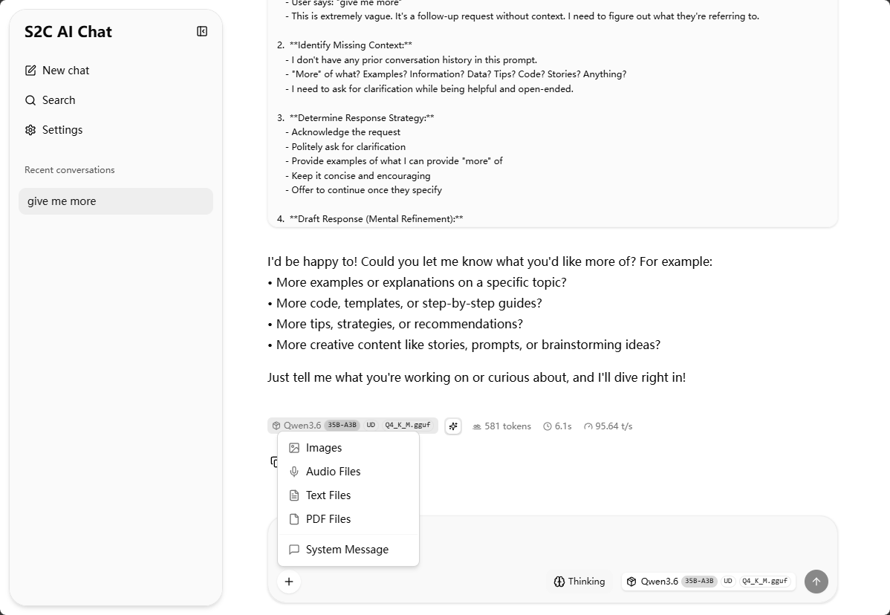

# LiteChat

<div align="center">

> 轻量级本地大模型聊天 WebUI，支持 vLLM、llama.cpp 及任何 OpenAI 兼容 API



[English](#english-readme)

</div>

---

## 简介

LiteChat 是基于 [llama.cpp WebUI](https://github.com/ggerganov/llama.cpp) fork 而来，针对企业内网部署进行了适配和优化。支持 vLLM、llama.cpp 等后端，可通过环境变量自定义后端地址和 App 名称，方便企业内部快速部署使用。

## 特性

- **多后端支持** — 原生支持 vLLM、llama.cpp，兼容任何 OpenAI 格式的 API（Ollama、LM Studio 等）
- **Think 模式切换** — 支持深度思考模型（如 DeepSeek R1、Qwen Thinking），可一键切换开启或关闭推理模式
- **vLLM 适配** — 修复了 vLLM 流式输出时前端 Token 速度统计不准确的问题，适配 `reasoning` 字段和 `usage` 精确统计
- **自定义后端与名称** — 通过 `.env` 文件配置后端 API 地址和应用名称，无需修改代码即可适配企业环境
- **精简高效** — 移除了企业场景不需要的 MCP 模块，优化打包体积（初始加载从 6.2MB 降至约 150KB）
- **纯静态部署** — 构建后生成纯静态文件，任何 HTTP 服务器均可部署，无需 Node.js 运行环境
- **Markdown 渲染** — 代码高亮、KaTeX 数学公式、表格等完整支持
- **会话分支** — 编辑、重新生成、分支导航
- **暗色/亮色主题** — 自动检测系统偏好

## 快速开始

### 1. 安装依赖

```bash
bun install
```

### 2. 配置环境变量

```bash
cp .env.example .env
```

编辑 `.env` 文件，修改后端地址和应用名称：

```env
# 后端 API 地址
VITE_API_TARGET=http://localhost:8000

# 应用名称（显示在页面标题和侧边栏）
VITE_PUBLIC_APP_NAME=LiteChat

# API Key（可选）
# VITE_API_KEY=your-api-key-here
```

常见的后端配置：

| 后端       | 默认端口 | 示例                           |
| ---------- | -------- | ------------------------------ |
| vLLM       | 8000     | `http://localhost:8000`        |
| llama.cpp  | 8080     | `http://localhost:8080`        |
| Ollama     | 11434    | `http://localhost:11434`       |
| LM Studio  | 1234     | `http://localhost:1234`        |

### 3. 运行

```bash
# 开发模式（热更新）
bun run dev

# 构建生产版本
bun run build
```

开发服务器默认在 `http://localhost:5173` 启动。

## 项目结构

```
webui/
├── src/
│   ├── lib/
│   │   ├── components/   # UI 组件
│   │   ├── stores/       # 状态管理（Svelte 5 runes）
│   │   ├── services/     # API 和数据服务
│   │   ├── types/        # TypeScript 类型定义
│   │   └── utils/        # 工具函数
│   ├── routes/           # SvelteKit 路由
│   └── app.html          # HTML 模板
├── static/               # 静态资源
├── scripts/
│   └── vite-plugin-llama-cpp-build.ts  # 构建后处理插件
├── .env.example          # 环境变量示例
├── svelte.config.js      # SvelteKit 配置
└── vite.config.ts        # Vite 配置
```

## 常用命令

| 命令                 | 说明                    |
| -------------------- | ----------------------- |
| `bun run dev`        | 启动开发服务器           |
| `bun run build`      | 构建生产版本             |
| `bun run preview`    | 本地预览生产构建         |
| `bun run check`      | TypeScript 类型检查      |
| `bun run lint`       | 代码风格检查             |
| `bun run format`     | 自动格式化代码           |

## 从 llama.cpp 的改进

| 特性               | 原始 llama.cpp WebUI         | LiteChat                          |
| ------------------ | ---------------------------- | --------------------------------- |
| 后端支持           | 仅 llama.cpp                 | vLLM、llama.cpp、OpenAI 兼容 API |
| Token 速度统计     | 仅 llama.cpp 精确             | vLLM 字符估算 + `usage` 精确统计  |
| 推理模式           | 不支持                       | 支持 `reasoning` / `reasoning_content` 切换 |
| 应用名称           | 硬编码                       | 通过 `VITE_PUBLIC_APP_NAME` 配置  |
| 打包体积           | ~6.2MB 单文件                | 分包加载，首屏约 150KB            |
| MCP 模块           | 完整支持                      | 已移除                             |
| 静态部署           | 依赖 llama-server 嵌入       | 纯静态文件，任意 HTTP 服务器可用    |

---

# <a id="english-readme">English README

<div align="center">

> Lightweight local LLM chat WebUI, supporting vLLM, llama.cpp, and any OpenAI-compatible API

[中文](#litechat)

</div>

---

## Overview

LiteChat is forked from [llama.cpp WebUI](https://github.com/ggerganov/llama.cpp), adapted and optimized for enterprise LAN deployment. It supports vLLM, llama.cpp, and any OpenAI-compatible API backend. Configure the backend API endpoint and app name via environment variables — no code changes needed.

## Features

- **Multi-backend Support** — Native support for vLLM, llama.cpp, and any OpenAI-compatible API (Ollama, LM Studio, etc.)
- **Think Mode Toggle** — Supports deep thinking models (e.g. DeepSeek R1, Qwen Thinking) with a one-click toggle to enable/disable reasoning mode
- **vLLM Compatibility** — Fixed token speed statistics for vLLM streaming, adapted `reasoning` field and `usage`-based precise token counting
- **Customizable Backend & Name** — Configure API endpoint and app name via `.env` for quick enterprise deployment
- **Optimized Bundle** — Removed unnecessary MCP module, reduced initial load from ~6.2MB to ~150KB with split chunk loading
- **Static Deployment** — Fully static build, deployable on any HTTP server without Node.js
- **Markdown Rendering** — Syntax highlighting, KaTeX math formulas, tables
- **Conversation Branching** — Edit, regenerate, and navigate between branches
- **Dark/Light Theme** — System preference detection

## Quick Start

### 1. Install Dependencies

```bash
bun install
```

### 2. Configure Environment

```bash
cp .env.example .env
```

Edit `.env` to set your backend and app name:

```env
# Backend API endpoint
VITE_API_TARGET=http://localhost:8000

# App name (displayed in page title and sidebar)
VITE_PUBLIC_APP_NAME=LiteChat

# API Key (optional)
# VITE_API_KEY=your-api-key-here
```

Common backend configurations:

| Backend     | Default Port | Example                      |
| ----------- | ------------ | ---------------------------- |
| vLLM        | 8000         | `http://localhost:8000`      |
| llama.cpp   | 8080         | `http://localhost:8080`      |
| Ollama      | 11434        | `http://localhost:11434`     |
| LM Studio   | 1234         | `http://localhost:1234`      |

### 3. Run

```bash
# Development mode (hot reload)
bun run dev

# Production build
bun run build
```

The dev server starts at `http://localhost:5173`.

## Project Structure

```
webui/
├── src/
│   ├── lib/
│   │   ├── components/   # UI components
│   │   ├── stores/       # State management (Svelte 5 runes)
│   │   ├── services/     # API and data services
│   │   ├── types/        # TypeScript type definitions
│   │   └── utils/        # Utility functions
│   ├── routes/           # SvelteKit routes
│   └── app.html          # HTML template
├── static/               # Static assets
├── scripts/
│   └── vite-plugin-llama-cpp-build.ts  # Post-build plugin
├── .env.example          # Environment variable template
├── svelte.config.js      # SvelteKit configuration
└── vite.config.ts        # Vite configuration
```

## Scripts

| Command              | Description                  |
| -------------------- | ---------------------------- |
| `bun run dev`        | Start development server     |
| `bun run build`      | Build for production         |
| `bun run preview`    | Preview production build     |
| `bun run check`      | TypeScript type checking     |
| `bun run lint`       | Lint code style              |
| `bun run format`     | Auto-format with Prettier    |

## Changes from llama.cpp WebUI

| Feature              | Original llama.cpp WebUI     | LiteChat                      |
| -------------------- | ---------------------------- | ----------------------------- |
| Backend Support      | llama.cpp only               | vLLM, llama.cpp, OpenAI-compatible |
| Token Speed Stats    | llama.cpp only               | vLLM char estimation + `usage`-based precise counting |
| Think/Reasoning Mode | Not supported                | `reasoning` / `reasoning_content` toggle support |
| App Name             | Hardcoded                    | Configurable via `VITE_PUBLIC_APP_NAME` |
| Bundle Size          | ~6.2MB single file           | Split chunks, ~150KB initial load |
| MCP Module           | Full support                 | Removed                       |
| Static Deployment    | Requires llama-server embed  | Pure static, any HTTP server  |

---

## Credits

This project is forked from [llama.cpp WebUI](https://github.com/ggerganov/llama.cpp) (MIT License).

Driven by **Qwen3.6 27B** (vLLM), **Claude**.
